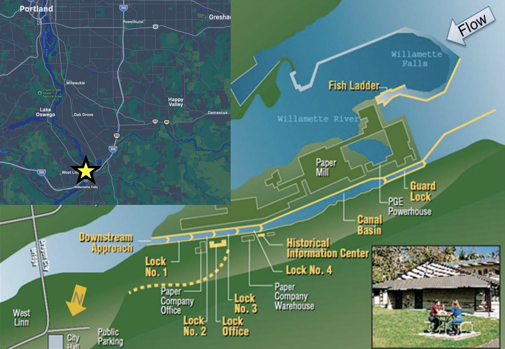

## Overview {.tabset .tabset-fade}

The data used for this analysis is comprised of adult fish passage recorded from 2001-01-01 to 2010-12-31 at Willamette Falls fish ladder on the Willamette River, Oregon. The data was shared by and accessed from Columbia River Data Access in Real Time (DART). Data collection and management is supported by a multitude of organizations including; U.S. Army Corps of Engineers, NWD and Chelan, Douglas, and Grant County PUDs, Yakima Klickitat Fisheries Project, Colville Tribes Fish & Wildlife (OBMEP), Oregon Department of Fish & Wildlife, Washington Department of Fish & Wildlife. This time series analysis visualizes daily, monthly, and annual counts of Steelhead, Coho, and Jack-Coho salmon species from 2001 through 2010. 


**Data citation:** Columbia River DART. 2010. Adult Fish Passage 2001-01-01 - 2010-12-31. Columbia Basin Research
School of Aquatic & Fishery Sciences, University of Washington. http://www.cbr.washington.edu/dart/query/adult_graph_text 

{width="100%"}

### **Map**

{width="75%"}
```{r setup, include=TRUE, warning = FALSE, message = FALSE}
knitr::opts_chunk$set(echo = TRUE, warning = FALSE, message = FALSE)
# Attach code chunk options and attach necessary pkgs

library(tidyverse)
library(here)
library(lubridate)
library(tsibble)
library(slider)
library(feasts)
library(cowplot)
library(patchwork)
```

```{r}
# Read in the data
fish <- read_csv(here("data", "willamette_fish_passage.csv")) %>% 
  janitor::clean_names()
```

```{r}
fish_ts <- fish %>% 
  mutate(date = lubridate::mdy(date)) %>%  # date is currently a character, need to convert to Date using lubridate() pkg
  as_tsibble(key = NULL, index = date) # then conver to time series data fram using tsibble pkg
```

```{r}
fish_ts_clean <- fish_ts %>% 
  select(date, steelhead, coho, jack_coho)  # select only necessary variables

fish_ts_longer <- pivot_longer(data = fish_ts_clean, # Need to convert species which are variables into obsv. (use pivot_longer)
             cols = steelhead:jack_coho,
             names_to = "species",
             values_to = "count") %>% 
  mutate(species_full = case_when(
    species == "steelhead" ~ "Steelhead",
    species =="coho" ~ "Coho",
    species == "jack_coho" ~ "Jack-Coho"
  ))

fish_ts_longer[is.na(fish_ts_longer)] <- 0
```


### Daily Time Series data

```{r}
# Make daily time series data using fish_ts_longer

ggplot(data = fish_ts_longer, aes(x = date, y = count)) +
  geom_line(aes(color = species)) +
  scale_color_manual(values = c("goldenrod", "darkseagreen4", "steelblue2")) +
  facet_grid(species_full ~., scales = "free_y") + # Freeing y-axis to better see trends/patters since counts vary so much between species
  theme_minimal() +
  theme(legend.position = "none") + # remove legend
  labs(y = "Count",
       x = "Date")
```

**Figure 1.** Daily count of Coho, Jack-Coho, and Steelhead salmon from 2001-2010. Note that y-scales vary between species to better display possible trends and patterns. 

- Steelhead are consistently the most abundant out of the three species, but since 2009 Coho salmon have had the highest counts passing through the fish ladder
- There are strong seasonality patterns, with Coho and Jack-Coho sharing the same season and Steelhead having its own season. 

### Seasonplots

``` {r}
# Wrangle for seasonplot
fish_month <- fish_ts_longer %>% 
  index_by(yr_mo = ~yearmonth(.))%>%  # use index_by() to group by the time index yearmonth
  group_by(species_full) %>%  
  summarize(total_count = sum(count, na.rm = TRUE)) # Need sum of all the counts in all of the months, e.g. sum of all fish counts in all months of May from 2001-2010

# Seasonplot using gg_season()
fish_month %>% 
  gg_season(y = total_count, year.labels = TRUE, continuous = TRUE,  pal = (scales::hue_pal())(3)) +
  theme_minimal()  +
  labs(y = "Total Count",
       x = "Month")

```

**Figure 2.** Season plot visualizing total monthly counts of Coho, Jack-Coho, and Steelhead Salmon in each year from 2001-2010. Note that y-scales vary between species to better display possible trends and patterns. 
 
- Coho and Jack-Coho salmon both pass through the fish ladder in the same season (Fall), while Steelhead passes peak in Spring
- Steelhead runs are relatively long (about 6 months) and they are still passing through the fish ladder at smaller abundances throughout the year
- Coho and Jack-Coho salmon pass through within three months in the Fall and they rarely pass through outside of their season


### Annual counts

```{r}
fish_annual <- fish_ts_longer %>% 
  index_by(yearly = ~year(.))%>% 
  group_by(species_full) %>% 
  summarize(mean_count = sum(count, na.rm = TRUE))

ggplot(data = fish_annual, aes(x = yearly, y = mean_count)) +
  geom_line(aes(color = species_full)) + # color corresponds to species
  scale_color_manual(values = c("goldenrod", "darkseagreen4", "steelblue2")) +
  facet_grid(species_full ~., scales = "free_y") + # Freeing y-axis to better see trends/patters since counts vary so much between species
  scale_x_continuous(breaks = c(2001:2010)) + # set breaks so every year shows up on x-axis
  theme_minimal() + 
  theme(legend.position = "none") + # remove legend
  labs(x = "Year", y = "Total Count")

```

**Figure 3.** Annual counts of Coho, Jack-Coho, and Steelhead salmon from 2001-2010. Note that y-scales vary between species to better display possible trends and patterns. 

- Coho salmon there is somewhat of a cyclical pattern with peaks in passage through the fish ladder every three years. There is a large peak in 2009 in which we can speculate the beginning of a possible increasing trend. However, we would need to include years 2010-current to be more certain
- Jack-Coho exhibit inconsistent cyclical patterns with peaks every 2-4 years in passage through the fish ladder. There may also be the beginning of a possible increasing trend beginning in 2008, but difficult to confirm without data from 2010-current
- Steelhead salmon show a strong cyclical pattern from 2001-2006 in which their counts peak every two years. However, we also see a strong decreasing trend from 2001-2009. There is some increase from 2009-2010, perhaps conservation efforts to recover the population. 


